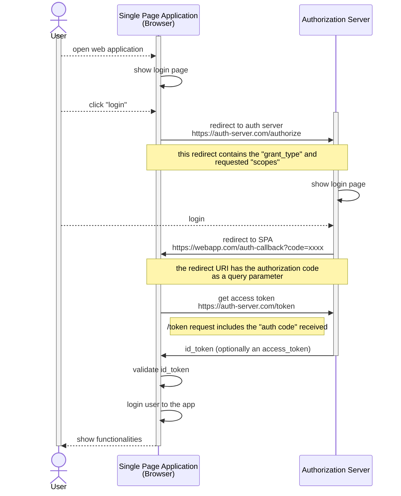
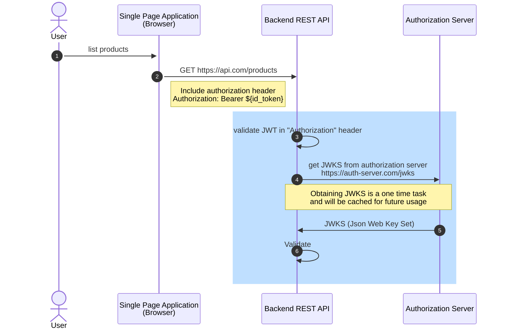

# Spring Boot REST API JWT Authentication with an external Authorization Server

_**keywords**_: Spring Boot, REST API, JWT, Authentication, Authorization Server, OAuth2 Resource Server

## Overview

This is a demo to show how we can use the Spring Boot's OAuthResourceServer's `jwt` authentication to protect a REST API 
using OpenID/OAuth2 tokens (ID Tokens/JWT) obtained from an external authorization server.
* `frontend` directory contains the example frontend

## Getting Started

1. Run the following command to build the backend
```bash
./mvnw clean install -DskipTests
```
2. Start the `JwtAuthIdentityProviderApplication` main class to start the REST API. It will start at http://localhost:8080
3. Run the following command to build and start the frontend (within the `frontend` directory):
```bash
npm install
npm start
```
The frontend React.js app will start at http://localhost:3000

## Authorization Code Flow



## Invoking the backend REST API

